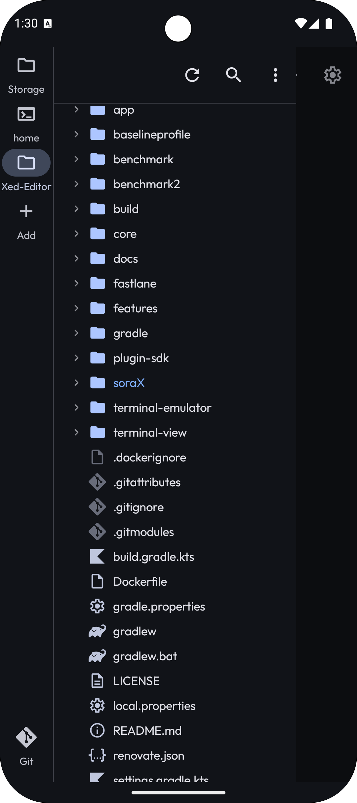
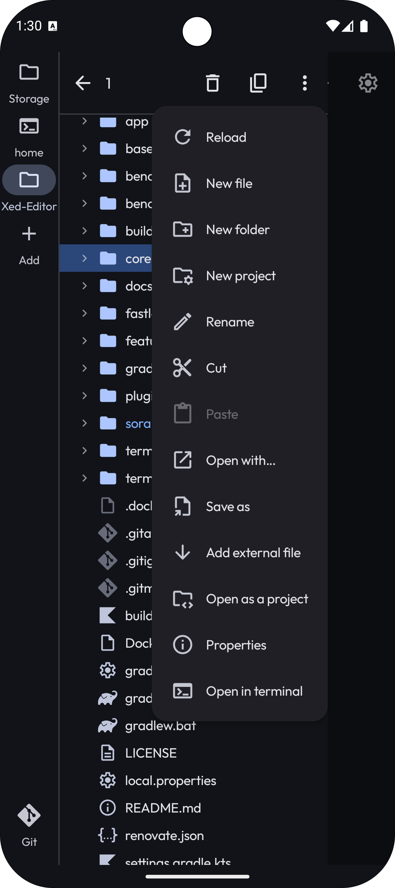
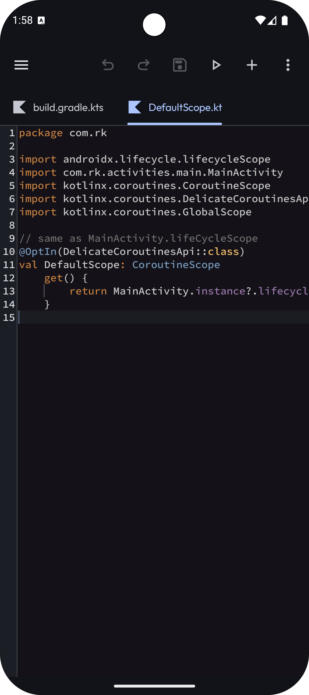
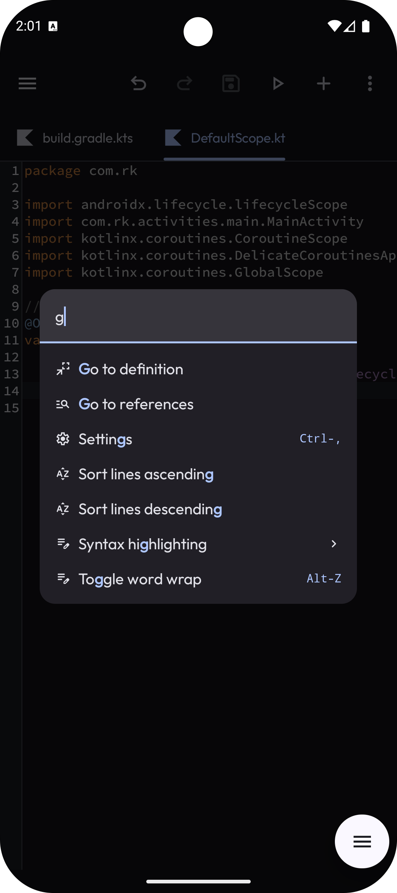
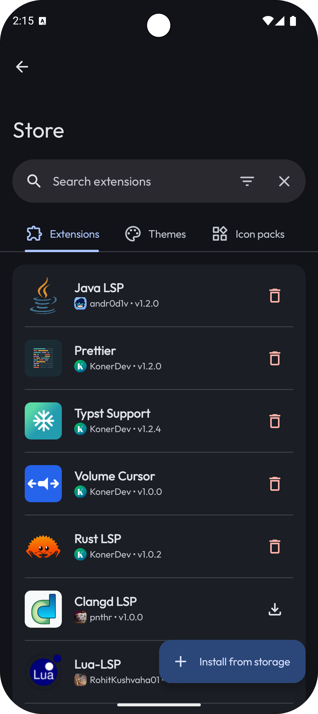
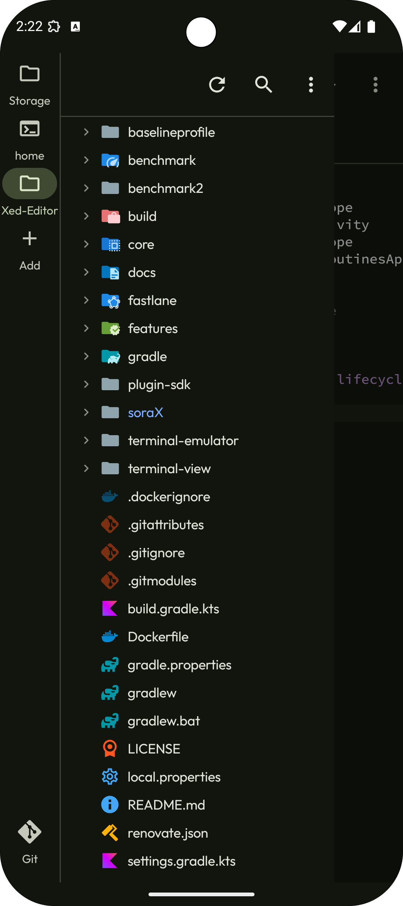
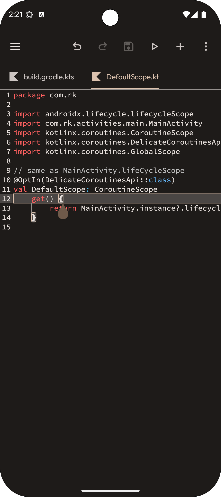
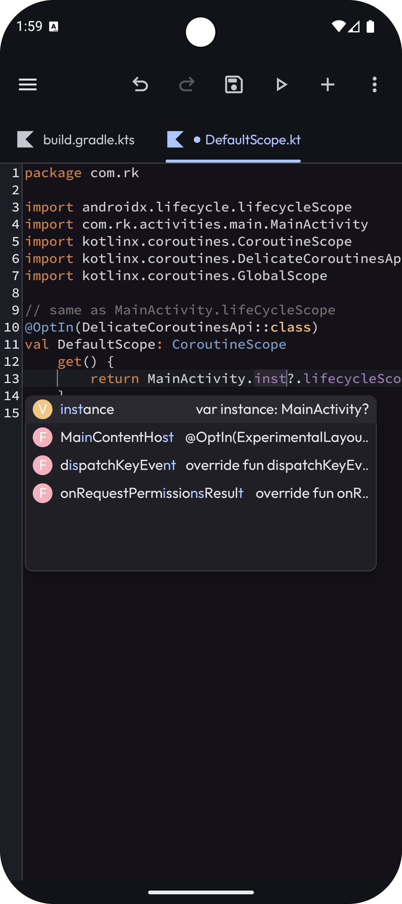
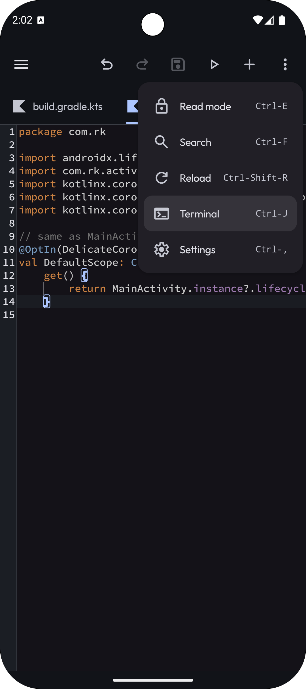
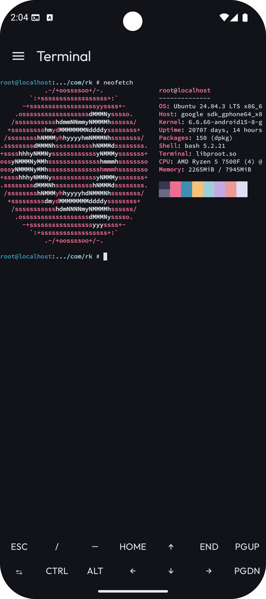

# Quick Start

Welcome to Xed-Editor! This guide will help you understand the basic layout of the app and how to
get started with your first project.

## The Sidebar (Drawer)

  
  

On the left side of the screen, you’ll find the **Sidebar**. This is where you manage your projects
and tools.

- **Projects**: Each tab in the sidebar can represent a different project folder. You can add more
  projects or tools (like Git or Terminal) using the **`+`** icon.
- **Reordering**: You can long-press and drag the icons in the sidebar to reorder them to your
  liking.
- **File Tree**: Within a project tab, you can see all your files and folders.
    - **Tap** a file to open it in the editor.
    - **Long-press** a file or folder to see available actions like rename, delete, or create new
      files.

## The Editor & Workspace

The main part of the screen is called the workspace/editor area.

- **Tabs**: Every file you open appears as a tab at the top. You can drag these tabs to reorder them
  or swipe them away to close them.
- **Scoped Tabs (Workspaces)**: By default, Xed-Editor uses `Scoped Tabs`. This means your open tabs
  are tied to the project currently selected in the sidebar. When you switch projects, Xed-Editor
  automatically swaps the tabs to show only those belonging to that project, giving each one its own
  dedicated workspace.

## Top Bar & Commands

The top bar provides quick access to actions and navigation.

- **Toolbar Actions**: On the right side of the top bar, you’ll see icons for common commands. You
  can choose which commands appear here in **`Settings > Editor > Toolbar Actions`**.
- **Command Palette**: Need to find a command quickly? Swipe down from the top toolbar to open the Command Palette.
  It allows you to search and execute any action in the editor.

## Extra Keys

When you have a file open, a special panel appears at the bottom of the screen.

- **Extra Keys**: This provides quick access to symbols (like `{`, `}`, `[`) and navigation keys.
- **Custom Commands**: Just like the top toolbar, you can pin your favorite commands to this bottom
  bar through **`Settings > Editor > Extra Keys`**.

## Customization & Store

  
  
  

Xed-Editor is designed to be personalized. Visit the built-in Store to download:

- **Themes**: Change the entire look and feel of the app.
- **Icon Packs**: Customize the file icons in the sidebar.
- **Extensions**: Add powerful new features, language support, and more.

## Language Support (LSP)

For a better coding experience, Xed-Editor supports the **Language Server Protocol (LSP)**. This
provides smart features like syntax highlighting, autocompletion, and error detection. You can learn
more about setting them up in our [LSP Guide](/docs/lsp/).

## Running Your Code

  
  

Xed-Editor isn't just for writing text; you can also execute your projects.

- **The Run Button**: Look for the "Play" icon in the top toolbar. Xed-Editor will automatically
  detect which [Runner](/docs/runners/) is best for your current file (like HTML, Python, or a
  custom script).
- **Terminal Integration**: For more control, you can always open the [Terminal](/docs/terminal/)
  through the pinned command in the toolbar.
