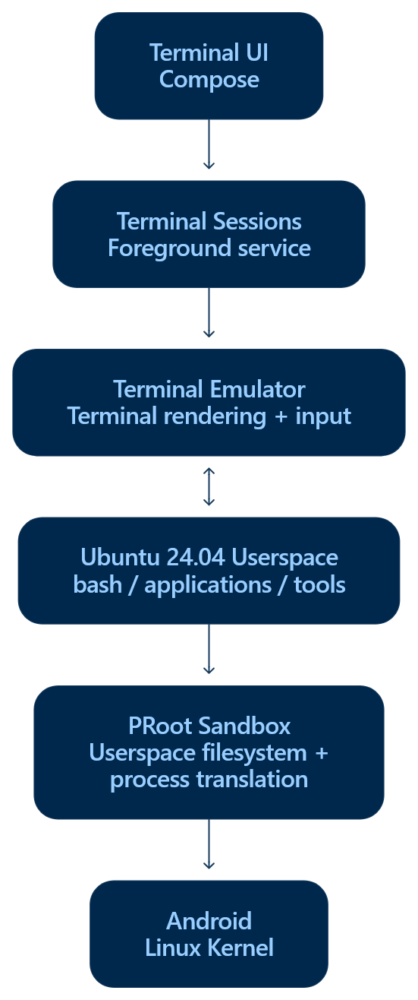

# Terminal

Xed-Editor ships with a fully-featured terminal that runs **Ubuntu 24.04** Linux Rootfs
distribution inside a sandbox. It is used for running commands, executing scripts, hosting language
servers and running code through the [runners](/docs/runners/).

Because the terminal runs a complete Ubuntu root filesystem, everything works like on a normal Linux
machine: `apt`, `pip`, `npm`, compilers, Git, and so on.

::: tip
New to the command line? Ubuntu provides a beginner-friendly guide covering essential commands,
files and directories, paths, and other terminal basics.

[Learn the Ubuntu command line](https://ubuntu.com/tutorials/command-line-for-beginners)
:::

::: warning
The terminal provides direct access to your filesystem and the ability to execute arbitrary
commands. Improper use of commands can permanently delete files or compromise the device. You are
responsible for understanding the commands you execute and their potential consequences.
:::

## How It Works

The terminal is not a toy shell that just emulates a few commands. It is a real Linux rootfs container
running on your Android device. To understand how that is possible, it helps to look at the layered
architecture:



1. **Terminal UI** renders the terminal screen, captures input, and provides terminal controls.
2. **Sessions** are managed by a foreground [`SessionService`](#session-service) so they keep
   running even when the terminal screen is closed.
3. The **terminal emulator** (upstream Termux code) handles terminal input/output and maintains the screen state, including text, colors, cursor position, and scrollback.
4. **Ubuntu userspace** provides `bash` and the Linux applications and tools running inside the terminal.
5. **PRoot** provides the userspace translation needed to run the Ubuntu environment on Android without root access.
6. The **Android kernel** actually executes everything. PRoot transparently rewrites filesystem and
   process operations so Ubuntu binaries believe they are running on a normal Linux machine.

<div style="clear: both"></div>

## First Launch & Setup

The first time you open the terminal, Xed-Editor downloads and installs the Ubuntu root filesystem.
This only happens once.

### Download

Depending on your device's CPU architecture, one of these rootfs archives is downloaded:

| Architecture           | Download                                |
|------------------------|-----------------------------------------|
| `arm64-v8a` (64-bit)   | `ubuntu-base-24.04.3-base-arm64.tar.gz` |
| `armeabi-v7a` (32-bit) | `ubuntu-base-24.04.3-base-armhf.tar.gz` |
| `x86_64`               | `ubuntu-base-24.04.3-base-amd64.tar.gz` |

The file is streamed to `cache/tempFiles/sandbox.tar.gz`. A progress screen with a live percentage
is shown while downloading. If the download is interrupted, it simply restarts from scratch the
next time.

### Extraction

When the download completes, the terminal starts in **extraction mode**. Instead of an interactive
shell, a special [`setup.sh`](#setup-script) script runs inside PRoot.

[Read more](advanced.md#terminal-extraction) about what the script does.

### The "Installed" Marker

Installation is tracked by a marker file:

```
<private>/local/.terminal_setup_ok_DO_NOT_REMOVE
```

The terminal counts as installed only when this marker exists **and** the rootfs directory is
non-empty. Deleting it will trigger a full reinstallation on next launch.

## The Ubuntu Sandbox

The Ubuntu root filesystem lives inside the app's private storage:

| Path                      | Purpose                             |
|---------------------------|-------------------------------------|
| `<private>/local/sandbox` | The Ubuntu root filesystem (`/`)    |
| `<private>/local/home`    | The user's home directory (`$HOME`) |
| `<private>/local/bin`     | Helper scripts and tools            |
| `<private>/local/lib`     | Native libraries                    |
| `<private>/local/stat`    | Generated CPU stats (see below)     |
| `<private>/local/vmstat`  | Generated memory stats (see below)  |

### What is PRoot?

[PRoot](https://proot-me.github.io/) is a user-space implementation of `chroot`, `mount --bind` and
`sudo`. It uses the Linux `ptrace` mechanism to intercept the system calls made by the traced
process and transparently:

- **Translates paths** so `/usr`, `/etc`, ... resolve inside `<private>/local/sandbox` instead of
  the real Android filesystem.
- **Binds host directories** into the guest namespace, e.g. `/sdcard` appears inside the Ubuntu
  filesystem.
- **Fakes root** so `apt`, `dpkg`, useradd, etc. work even though the app runs as a normal
  (unprivileged) Android app.
- **Emulates some Linux features** that Android lacks (e.g. System V IPC, seccomp quirks).

No root access is needed. PRoot works entirely in user space by tracing syscalls.

### Seccomp

Some devices (especially recent Snapdragon/MediaTek chips) return `Function not implemented`
errors when running certain syscalls inside PRoot. Xed-Editor lets you choose how PRoot handles
seccomp (the kernel's system call filter) in **Settings → Terminal → SECCOMP**:

| Value         | Effect                                                         |
|---------------|----------------------------------------------------------------|
| `Unspecified` | Let PRoot decide (default)                                     |
| `Yes`         | Use PRoot's seccomp acceleration (`SECCOMP=1`)                 |
| `No`          | Disable seccomp (`PROOT_NO_SECCOMP=1`), use when syscalls fail |

This setting is applied to every session and to every `ubuntuProcess` invocation.

## Shell Configuration

The terminal uses **Bash** as its default shell. You can customize your shell environment by
editing the `~/.bashrc` file inside the Ubuntu environment.

For example:

```bash
nano ~/.bashrc
````

Changes to `~/.bashrc` are applied when you start a new terminal session. To apply changes to the
current session immediately, run:

```bash
source ~/.bashrc
```

You can use `~/.bashrc` to add aliases, environment variables, functions, or other Bash
configuration.

[Read more](advanced.md#shell-startup) about how the shell is configured.

## Where the Shell Starts (Working Directory)

The starting directory is determined in order:

1. If a command was launched with an explicit working directory (e.g. the universal runner passes
   the file's parent folder), that directory is used.
2. If the terminal was opened from a file/folder ("Open in terminal"), that path is used.
3. If **Settings → Terminal → Use project as working directory** is enabled and an editor tab is
   open, the current file's parent directory is used.
4. Otherwise it falls back to `/home` (sandboxed) or the sandbox home directory.

The working directory is exported as `WKDIR` and also used by the `init` script.

## Sessions

A **session** is a single running shell process connected to the terminal screen. You can have
multiple sessions open at once, each with its own shell, working directory and scrollback.
Each shell

### Session Service

All sessions are owned by a foreground **`SessionService`** (an Android foreground service). This is
what lets the terminal keep running, and keep running *commands*, even when you leave the screen
or switch to another app. The service shows a persistent notification showing how many sessions are
running, with two actions:

- **Exit** kills all sessions and stops the service.
- **Wake lock** (acquire/release) toggles a partial wake lock so long-running commands aren't
  paused when the screen turns off.

The session service also hosts the [`xed` socket server](#the-xed-command) and the
[/proc virtualizer](#proc-virtualization).

### Managing Sessions

Open the navigation drawer in the terminal (tap the menu icon) to see all sessions. From there you
can:

- **Add a session** creates a new one named `main #1`, `main #2`, etc.
- **Switch sessions** tap a session to switch to it.
- **Rename sessions** tap the edit icon next to a session.
- **Delete sessions** tap the delete icon; if it was the current session, the terminal switches to
  a neighboring session first. Deleting the last session closes the terminal and stops the service.
- **Exit** when a session's process has finished, pressing Enter in that session terminates it
  and returns to the previous session (or finishes the activity).

### Failsafe Mode

In debug builds, **Settings → Terminal → Failsafe mode** starts the terminal *without* the Ubuntu
sandbox. It runs `/system/bin/sh` directly with a minimal set of bindings and environment. This is
useful for recovering a broken installation (e.g. when the rootfs fails to boot).

## The `xed` Command

Inside the Ubuntu container, a command called `xed` is available. It allows you to open files in the editor directly
from the terminal:

```sh
xed path/to/file.py path/to/other.txt
```

If you pass a folder instead, it will open a new project:

```sh
xed path/to/folder
```

[Read more](advanced.md#the-xed-command) about how it works.

## /proc Virtualization

Android restricts real CPU/memory statistics, so the terminal would see empty `/proc/stat` and
`/proc/vmstat` files, breaking tools like `top`, `htop`, `neofetch`, and load reporting.

Xed-Editor solves this with a background **StatUpdater** (started with the session service) that
every second:

- Reads the app's *real* CPU usage from `/proc/<pid>/stat` of its own processes and computes
  per-core deltas.
- Adds a small simulated background load so the numbers look alive.
- Distributes ticks across the actual number of cores.
- Writes a well-formed `/proc/stat` file (with `cpu`, `cpu0..N`, `intr`, `ctxt`, `btime`, ...).
- Reads the *real* memory info via `ActivityManager.MemoryInfo` and writes a realistic
  `/proc/vmstat` file (free pages, anon/file pages, swap, page faults, ...).

These files live at `<private>/local/stat` and `<private>/local/vmstat` and are bound into the
container at `/proc/stat` and `/proc/vmstat` (see [default bindings](#default-bindings)).

## Virtual Keys / Extra Keys

The extra keys row follows the [**Termux extra keys**](https://wiki.termux.com/wiki/Touch_Keyboard#Extra_Keys_Row)
format, a JSON array of rows, where each row is a list of keys. You can edit it in **Settings →
Terminal → Change extra keys**.

Each key can be:

- A simple string: `"ESC"`, `"TAB"`, `"HOME"`, `"UP"`, `"PGDN"`, ...
- An object with a `key` and optional `popup` for swipe-up alternatives:
  `{"key": "-", "popup": "|"}`.
- A `macro` for key combinations: `{"macro": "CTRL C", "display": "copy"}`.

Aliases are supported (e.g. `ESCAPE` → `ESC`, `RETURN` → `ENTER`, `PAGE_UP` → `PGUP`). The default
layout is:

```json
[
  ["ESC", {"key": "/", "popup": "\\"}, {"key": "-", "popup": "|"}, "HOME", "UP", "END", "PGUP"],
  ["TAB", "CTRL", "ALT", "LEFT", "DOWN", "RIGHT", "PGDN"]
]
```

CTRL / ALT / SHIFT / FN are toggles, tap them once to apply the modifier to the next key.

## Colors & Fonts

The terminal respects the active theme:

- Colors come from the theme's `terminalColors` palette plus the theme's `onSurface` (foreground)
  and `surface` (background).
- Font size can be adjusted with **Settings → Terminal → Text size** (10–20) or by pinch-zooming
  directly on the screen (11–45 range).
- The font can be changed in **Settings → Terminal → Manage terminal fonts**.

::: warning
If the sandbox contains a font at `etc/font.ttf`, it overrides the custom font setting. Delete that
file inside the terminal to use the configured font instead.
:::

## Cursor Style

Choose the cursor shape in **Settings → Terminal → Cursor style**: block, bar or underline. The
cursor also blinks while a session is running.

## Settings Reference

All terminal settings live under **Settings → Terminal**:

| Setting                          | Description                                                                         |
|----------------------------------|-------------------------------------------------------------------------------------|
| Text size                        | Font size in the terminal (10–20)                                                   |
| Manage terminal fonts            | Choose a custom font file                                                           |
| Cursor style                     | Block, bar or underline cursor                                                      |
| SECCOMP                          | Seccomp handling for PRoot (see above)                                              |
| Terminal health                  | Runs diagnostics (see below)                                                        |
| Change extra keys                | Edit the virtual keys row (Termux format)                                           |
| Clipboard keybindings            | Enable Ctrl+C/Ctrl+V style clipboard shortcuts                                      |
| Scrollback buffer size           | Lines of history kept in memory (100–50,000; default 5,000), requires a restart     |
| Terminate all sessions           | Kill all sessions when the app is closed                                            |
| Use project as working directory | Start the shell in the current project/editor folder                                |
| Expose home directory            | Make the terminal home accessible to external apps via the system file picker (SAF) |
| Failsafe mode (debug only)       | Run `/system/bin/sh` directly without the Ubuntu sandbox                            |
| Backup                           | Create a `terminal-backup.tar.gz` of the sandbox                                    |
| Restore                          | Restore the sandbox from a backup archive                                           |
| Uninstall terminal               | Permanently remove the Ubuntu rootfs, helpers and marker file                       |

### Backup & Restore

Backups are full `tar.gz` archives of the sandbox rootfs, excluding volatile/system directories
(`dev`, `sys`, `proc`, `system`, `apex`, `vendor`, `data`, `home`, `root`, caches, ...).

- **Backup** lets you pick a location via the system file picker and writes the archive there.
- **Restore** reads an archive, wipes the sandbox and extracts it, then re-creates the installed
  marker.

### Uninstalling

"Uninstall terminal" deletes `<private>/local/bin`, `<private>/local/lib`, the sandbox rootfs and
the installed marker. The next time the terminal is opened, a fresh Ubuntu is downloaded and
installed.
